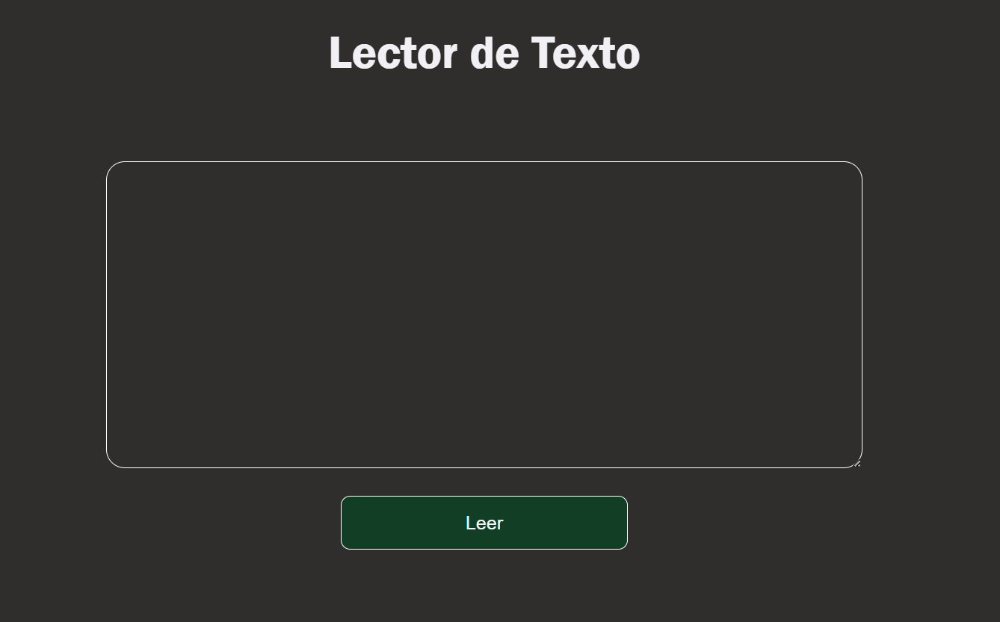

# Text to Speech

Este proyecto en JavaScript te permite convertir texto escrito en inglés en voz mediante el uso de un navegador web. Con tan solo escribir en un área de texto y hacer clic en un botón, el navegador leerá el texto en voz alta.

## Visualizacion

